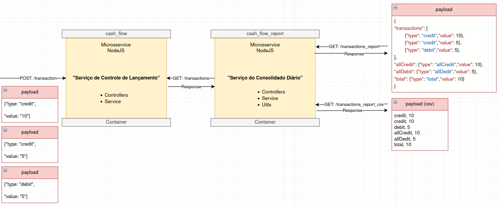
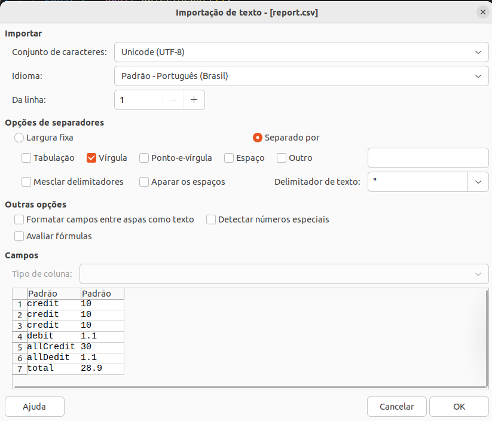

# store_management_cash_flow

Simple microsservices to management of Store Cash Flow (credit and debit). Container Communication between API.

1 - Microsservice **cash_flow** receives posts of credit or debit.

2 - Microsservice **cash_flow_report** consults microsservice **cash_flow** to generate report **in csv format**, that can be downloaded.

## Requirements

docker
## Installation

1 - Download Repository.


2 - Building Images:
```bash
Inside of directory of cash_flow folder:
    cd cash_flow 
    docker build -t cash_flow_service .

Inside of directory of cash_flow_report folder:
    cd cash_flow_report 
    docker build -t cash_flow_report_service .
```

3 - Create the network for communication between containers **(As example network_name = local_test)**:
```bash
docker network create local_test
```

4 - Run Images and connect to recent created network:
```bash
docker run --name cash_flow_container -p 3001:3001 --network=local_test cash_flow_service
docker run --name cash_flow_report_container -p 3002:3002 --network=local_test cash_flow_report_service
```
    
5 - Append to logs of each container (optional for who use -d in run):
```bash
docker ps -a
docker logs -f <CONTAINER ID>
```
## Screenshots






## Usage/Examples

**POSTMAN COLLECTION INCLUDED IN REPOSITORY (optionally)**

- SERVICE **cash_flow on port 3001**

```javascript
curl --location 'http://localhost:3001/transaction' \
--header 'Content-Type: application/json' \
--data '{
    "type": "credit",
    "value": 10
}'
```

```javascript
curl --location 'http://localhost:3001/transactions'
```

- SERVICE **cash_flow_report on port 3002**

```javascript
curl --location 'http://localhost:3002/transactions_report'
```

```javascript
curl --location 'http://localhost:3002/transactions_report_csv'
```

## Uninstallation

1 - Remove containers:
```bash
List all containers:
    docker container ls -a
Stop each container: 
    docker stop <CONTAINER ID>
Prune (Remove all stopped containers):
    docker container prune 
```

2 - Remove images:
```bash
List all images:
    docker image ls -a 
Remove each image:
    docker rmi <IMAGE ID>
```
## Authors

- [@lcoutojunior](https://www.github.com/lcoutojunior)

